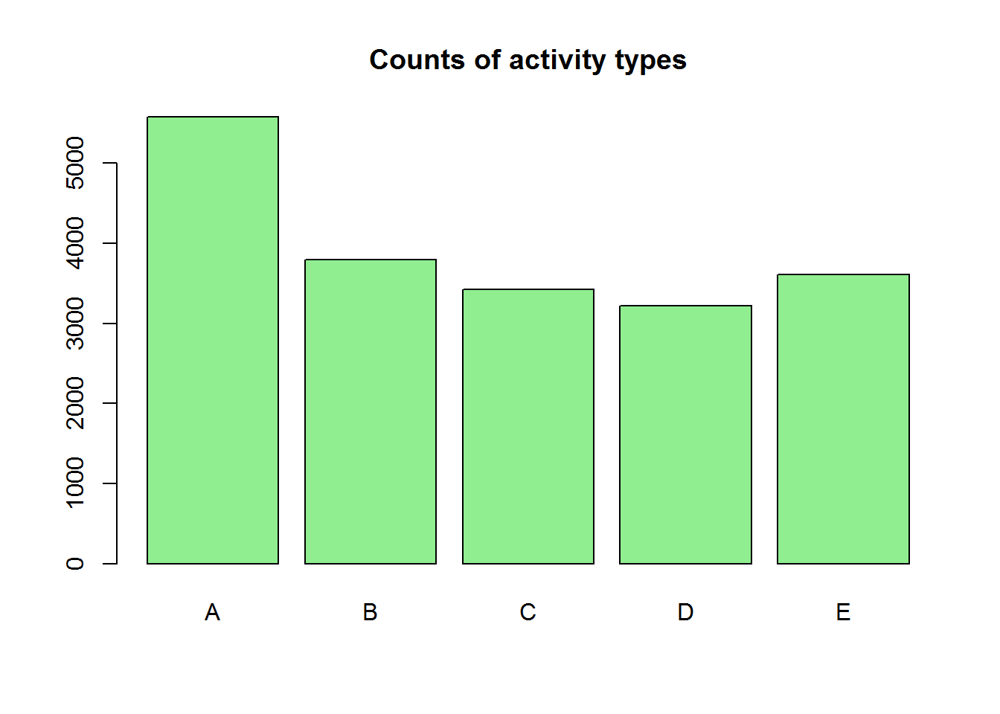

# Prediction Assignment
Vadim K  
July 21, 2016  

##Introduction

Using devices such as Jawbone Up, Nike FuelBand, and Fitbit it is now possible to collect a large amount of data about personal activity relatively inexpensively. These type of devices are part of the quantified self movement - a group of enthusiasts who take measurements about themselves regularly to improve their health, to find patterns in their behavior, or because they are tech geeks. 

##Objective

One thing that people regularly do is quantify how much of a particular activity they do, but they rarely quantify how well they do it. In this project, the goal is  to use data from accelerometers on the belt, forearm, arm, and dumbell of 6 participants. They were asked to perform barbell lifts correctly and incorrectly in 5 different ways. 
More information is available from the website here: 
http://groupware.les.inf.puc-rio.br/har

##Data Processing

Start by downloading the data and reading it into the R as a dataframe

```r
knitr::opts_chunk$set(echo = TRUE)

library(caret)
download.file("https://d396qusza40orc.cloudfront.net/predmachlearn/pml-training.csv", "training.csv")
download.file("https://d396qusza40orc.cloudfront.net/predmachlearn/pml-testing.csv", "testing.csv")

training <- read.csv("training.csv")
testing <- read.csv("testing.csv")

#Quick look at the training results
barplot(summary(training$classe), col = "lightgreen", main = "Counts of activity types")
```

<!-- -->

Inspection of the data reveals that in many place the data has NA values, so at the 1st step let's inspect what the magnitude of the issue is.

```r
a <- as.data.frame(names(training))
a$`names(training)` <- as.character(a$`names(training)`)

for (i in 1:nrow(a)) {
      a[i,2] <- 100*(sum(is.na(training[,i]))/length(training[,i]))
}
sum(a[,2]!=0)
```

```
## [1] 67
```

Furthermore, there are data where values are missing. In oder to roceed forward with the modeling, we need to clean the data first. I will do it for both the training set and the testing set.

```r
testing <- testing[,apply(training, 2, function(x) any(is.na(x) | x == "") == FALSE)]
training <- training[,apply(training, 2, function(x) any(is.na(x) | x == "") == FALSE)]


b <- c("X", "user_name", "raw_timestamp_part_1", "raw_timestamp_part_2", "cvtd_timestamp", "new_window", "num_window")

training <- training[, !(names(training) %in% b)]
testing <- testing[, !(names(testing) %in% b)]
```

##Analysis

Now, we are ready to build the prediction model. Since the desired prediction is a qualatative variable, it would be appropriate to apply Random Forest method. To do the model let's split the Training dataset into 2 subsets: one for model building and the second for validation.

```r
library(caret)
inBuild <- createDataPartition(y=training$classe, p=0.7, list=FALSE)
validation <- training[-inBuild,]; train <- training[inBuild,]

fitRF <- train(classe ~ ., method = "rf", data = train, trControl = trainControl(method="cv" ,number=3))

predRF <- predict(fitRF, validation)
confusionMatrix(predRF, validation$classe)$overall['Accuracy']
```

```
##  Accuracy 
## 0.9909941
```

It looks as if the model provides an extremely good accuracy. Let's take a look at the confusion matrix in full

```r
confusionMatrix(predRF, validation$classe)
```

```
## Confusion Matrix and Statistics
## 
##           Reference
## Prediction    A    B    C    D    E
##          A 1668    9    0    0    0
##          B    2 1128    5    0    0
##          C    4    2 1021   23    0
##          D    0    0    0  941    8
##          E    0    0    0    0 1074
## 
## Overall Statistics
##                                           
##                Accuracy : 0.991           
##                  95% CI : (0.9882, 0.9932)
##     No Information Rate : 0.2845          
##     P-Value [Acc > NIR] : < 2.2e-16       
##                                           
##                   Kappa : 0.9886          
##  Mcnemar's Test P-Value : NA              
## 
## Statistics by Class:
## 
##                      Class: A Class: B Class: C Class: D Class: E
## Sensitivity            0.9964   0.9903   0.9951   0.9761   0.9926
## Specificity            0.9979   0.9985   0.9940   0.9984   1.0000
## Pos Pred Value         0.9946   0.9938   0.9724   0.9916   1.0000
## Neg Pred Value         0.9986   0.9977   0.9990   0.9953   0.9983
## Prevalence             0.2845   0.1935   0.1743   0.1638   0.1839
## Detection Rate         0.2834   0.1917   0.1735   0.1599   0.1825
## Detection Prevalence   0.2850   0.1929   0.1784   0.1613   0.1825
## Balanced Accuracy      0.9971   0.9944   0.9946   0.9873   0.9963
```

Lastly, let's use the model to predict the results on the 20 test cases

```r
predRF.new <- predict(fitRF, testing)
print(predRF.new)
```

```
##  [1] B A B A A E D B A A B C B A E E A B B B
## Levels: A B C D E
```
